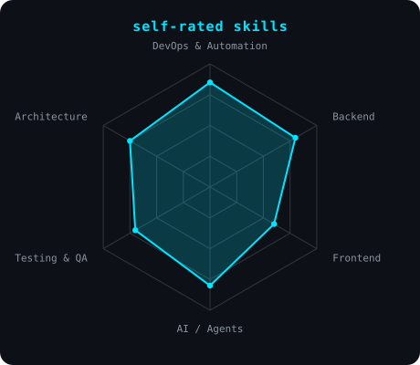
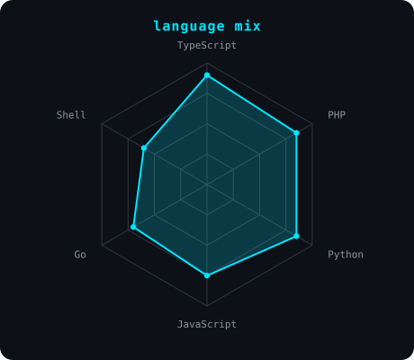
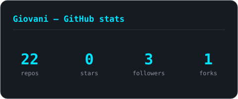
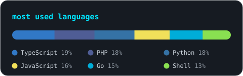

<!-- BANNER — terminal profile.sh --live. Generated by scripts/banner.py from assets/banner.json. -->
<picture>
  <source media="(prefers-color-scheme: dark)"  srcset="assets/banner-dark.svg">
  <source media="(prefers-color-scheme: light)" srcset="assets/banner-light.svg">
  
</picture>

 

<!-- NAME / TAGLINE — animated typing -->

 

<!-- SOCIALS -->
&nbsp;
&nbsp;

  

<!-- Profile views — powered by https://github.com/antonkomarev/github-profile-views-counter -->

---

## `whoami`

DevOps & Full-Stack Engineer based in **São Paulo, Brazil** 🇧🇷. I build the plumbing that
ships and runs software — automation, containers, CI/CD — and lately I'm deep into
**AI coding agents**: harnesses that give an LLM context, tools, state, limits and
verifiable feedback so it behaves like a component in a real system, not a magic box.

- 🔧 **DevOps & automation** — Docker, GitHub Actions, CI/CD, shell tooling.
- 🧠 **AI-assisted engineering** — coding-agent harnesses, MCP routing, policy-driven quality gates.
- 🧩 **Full-stack** — TypeScript/Vue front-ends, Python & PHP back-ends, event-driven services.
- 🌱 Always shipping real things and sharpening the craft.

## my stack

---

## signals

<table>
<tr>
<td width="50%" align="center" valign="top">

<!-- Self-rated skills radar — edit assets/skills.json, CI redraws it. -->
<picture>
  <source media="(prefers-color-scheme: dark)"  srcset="assets/radar-dark.svg">
  <source media="(prefers-color-scheme: light)" srcset="assets/radar-light.svg">
  
</picture>

</td>
<td width="50%" align="center" valign="top">

<!-- Language radar — evidence-based, edit assets/langmix.json. -->
<picture>
  <source media="(prefers-color-scheme: dark)"  srcset="assets/radar-langs-dark.svg">
  <source media="(prefers-color-scheme: light)" srcset="assets/radar-langs-light.svg">
  
</picture>

</td>
</tr>
</table>

## numbers

<!-- Self-hosted, generated by scripts/. Not github-readme-stats: no shared public instance to go down. -->
<picture>
  <source media="(prefers-color-scheme: dark)"  srcset="assets/card-stats-dark.svg">
  <source media="(prefers-color-scheme: light)" srcset="assets/card-stats-light.svg">
  
</picture>

 

<picture>
  <source media="(prefers-color-scheme: dark)"  srcset="assets/languages-dark.svg">
  <source media="(prefers-color-scheme: light)" srcset="assets/languages-light.svg">
  
</picture>

---

## 🚀 Featured projects

> Ranked by complexity. Accent colour tracks it:  →  → .

### [git-codeReview-vsCode-extension](https://github.com/GiovaniRodrigo/git-codeReview-vsCode-extension) 
Professional VS Code extension for **architectural code review**, PR analysis and engineering telemetry with Material Design 3 — detects SOLID / Clean Architecture / DDD violations and reviews commits, branches and PRs directly in the editor.
   

### [arquitetura-mach-saas-nocode](https://github.com/GiovaniRodrigo/arquitetura-mach-saas-nocode) 
**MACH V4** low-code/no-code platform — a unified distributed-architecture spec: gRPC contracts via Protocol Buffers, dynamic key-value payload mapping and component-level IAM, so users build digital apps through a visual interface.
    

### [event-driven-kafka](https://github.com/GiovaniRodrigo/event-driven-kafka) 
Event-driven architecture built around **Apache Kafka**, containerised with Docker — a playground for asynchronous, message-based service design in TypeScript.
   

### [network-monitoring-saas](https://github.com/GiovaniRodrigo/network-monitoring-saas) 
SaaS for **intelligent network monitoring** — automatic device discovery, metric collection, traffic analysis, geolocation, anomaly detection and an operational dashboard that turns raw network data into actionable insight in near real time.
   

### [harness-code-agent](https://github.com/GiovaniRodrigo/harness-code-agent) 
A minimal but real **harness for a coding agent** — the LLM is a component inside a system that supplies context, tools, state, limits and verifiable feedback, with an evaluator that runs the tests and loops pass/fail back into the model.
  

### [software-quality-ai-harness](https://github.com/GiovaniRodrigo/software-quality-ai-harness) 
A **policy-driven evidence & context harness** for AI-assisted software engineering — connects an agent to current, authoritative engineering evidence while keeping the judgment rules explicit, versioned, auditable and testable.
  

<b>More projects</b> (11 more real repositories)

 

| Project | What it is | Tech |
|---|---|---|
| [efficiency-algorithm-blind-index](https://github.com/GiovaniRodrigo/efficiency-algorithm-blind-index) | Benchmarks the performance impact of **blind indexes** on searchable encrypted databases (CPF, emails, names encrypted at rest but still queryable). | Python |
| [laravel-spelling-lib](https://github.com/GiovaniRodrigo/laravel-spelling-lib) | PHP **spell-checking library** (Composite Pattern), pt_BR + en_US — published on Packagist. | PHP |
| [site-to-markdown](https://github.com/GiovaniRodrigo/site-to-markdown) | *GF Code* browser extension (Manifest V3) that converts web pages to clean **Markdown**. | JavaScript |
| [e-commerce](https://github.com/GiovaniRodrigo/e-commerce) | Full-stack **e-commerce** app — Vue front-end on a PHP/Laravel back-end. | Vue · PHP |
| [form-validator-audit](https://github.com/GiovaniRodrigo/form-validator-audit) | *Form Test Auditor* — cross-browser WebExtension (MV3) that crawls same-domain URLs, discovers forms/fields and tests valid & invalid inputs. | JavaScript |
| [validar_dependecias_token_certisign](https://github.com/GiovaniRodrigo/validar_dependecias_token_certisign) | Windows/Linux scripts that validate the dependencies for **A3 digital certificates** (Certisign tokens). | C |
| [mpc-server-list](https://github.com/GiovaniRodrigo/mpc-server-list) | **MCP** server catalog + dynamic routing engine — a gateway abstracting init/communication/execution of Model Context Protocol tools. | Python · HTML |
| [gerador_dockefile_php](https://github.com/GiovaniRodrigo/gerador_dockefile_php) | Generates customised **PHP Dockerfiles** with selectable extensions per PHP version. | Python · Docker |
| [git-scripts](https://github.com/GiovaniRodrigo/git-scripts) | Git aliases for safe, automated **branch management** (local + cloud) with backup. | Shell |
| [azure_tasks](https://github.com/GiovaniRodrigo/azure_tasks) | Automation tasks on **Azure**. | Azure |
| [ia-assistant-context](https://github.com/GiovaniRodrigo/ia-assistant-context) | A repo **template for Context-Driven Development** — living docs and workflows that keep AI-assisted work architecturally consistent. | Docs |

---

## 💡 Open to

**DevOps** · **Backend** · **Full-Stack** · freelance/contract (Python, Docker, automation, AI agents). Reach out on [LinkedIn](https://www.linkedin.com/in/giovanirodrigo/) or by [email](mailto:giovanif245@gmail.com).

<code>build with automation · @GiovaniRodrigo</code> · assets self-generated by <code>scripts/</code> via GitHub Actions

