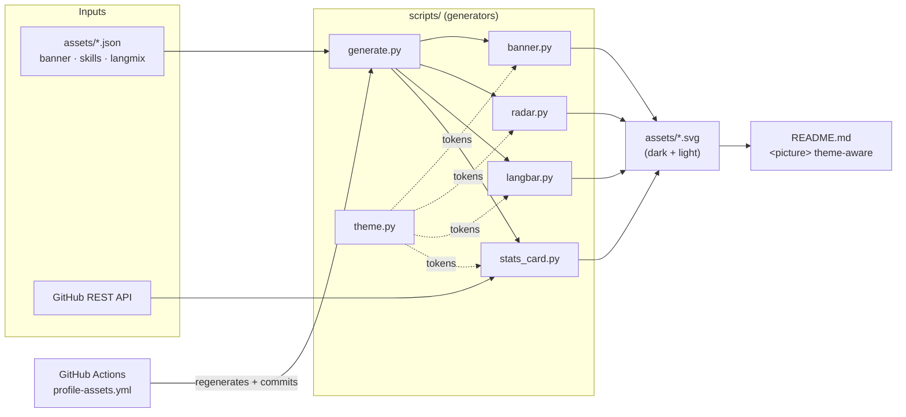

# How this profile works

🇺🇸 English · [🇧🇷 Português](HOW-IT-WORKS.pt-BR.md)

This repository is my GitHub **profile** — its `README.md` renders on my profile page. The
visuals are not hand-drawn images: they're **SVGs generated from data** by small Python
scripts, kept fresh by a GitHub Actions workflow. This document walks through how the
machine is built, piece by piece, and how to change any part of it (or fork it for your own
profile).

## Overview



**The idea:** editable data (`assets/*.json`) plus live GitHub data flow through pure
generators into themed SVGs, which the README shows via `<picture>` so each viewer sees the
dark or light variant. CI reruns the generators and commits the results, so the profile
stays current with zero manual work.

## Quickstart

```bash
git clone https://github.com/GiovaniRodrigo/GiovaniRodrigo.git
cd GiovaniRodrigo
python scripts/generate.py     # regenerate every SVG into assets/
python -m pytest -q            # run the test suite (41 tests)
```

No third-party Python packages are required to generate assets — the scripts use only the
standard library. `pytest` is the only dev dependency.

## The build, step by step

### 1. Theme tokens — `scripts/theme.py`

Every generator shares one palette. `theme("dark")` / `theme("light")` return a flat dict of
tokens (`bg`, `panel`, `grid`, `text`, `muted`, `accent`, …). The base is GitHub's neutral
dark `#0d1117`; the accent is a tech-neon cyan. Neon reads bright on dark but vanishes on
white, so the light theme swaps it for a deeper, still-vivid variant. Change the whole look
from this one file.

### 2. Banner — `scripts/banner.py` + `assets/banner.json`

Renders the animated `profile.sh --live` terminal window. Edit the content in
`assets/banner.json`:

```json
{
  "prompt": "$ ./profile.sh --live",
  "lines": [
    { "key": "role", "value": "DevOps & Full-Stack Engineer" }
  ]
}
```

Lines reveal one after another via SMIL `<animate>` (which works on GitHub when an SVG is
served as an image), and a block cursor blinks at the end.

### 3. Radars — `scripts/radar.py` + `assets/skills.json`, `assets/langmix.json`

One renderer drives both radar charts. Each data file is a list of axes:

```json
{ "title": "self-rated skills", "axes": [ { "label": "Backend", "value": 80 } ] }
```

`skills.json` is a **self-rated** skill radar (edit the numbers to taste). `langmix.json` is
the **language** radar, weighted from real repository data. Values are `0..100`; at least
three axes are required.

### 4. Language bar — `scripts/langbar.py` + `assets/langmix.json`

A horizontal stacked bar with a legend, normalising the same `langmix.json` weights into
percentages. It's committed so the profile never shows a broken image, independent of any
external service.

### 5. Stats card — `scripts/stats_card.py`

The only generator that hits the network. It keeps three concerns separate:

- `fetch(user, token)` — thin GitHub REST adapter (repos, stars, followers).
- `render(stats, theme)` — pure SVG renderer.
- `main()` — wires fetch → render → file, reading a token from `METRICS_TOKEN` or
  `GITHUB_TOKEN` in the environment.

A token is optional for public data; it only raises API rate limits. Language byte totals
are de-noised of vendored dependencies (a committed virtualenv in one repo would otherwise
read as "94% Python").

### 6. Orchestrator — `scripts/generate.py`

Runs every generator in order and writes all ten SVGs into `assets/`. If the network call
for the stats card fails, it logs a warning and still produces the offline assets.

## The render seam & tests

Each generator exposes a **pure function** `render(data, theme) -> str` that returns SVG
markup with no network or filesystem access. That single boundary is the test seam: the
suite (`tests/`) feeds fixed fixtures and asserts *externally observable* properties — the
SVG is well-formed XML, every label/value appears, the two themes differ, and malformed
input raises `ValueError`. Because `render` touches nothing external, the tests are offline
and deterministic. The `fetch` adapter is deliberately kept thin and out of the unit tests.

## Theme-aware rendering in the README

Each asset is emitted in a `dark` and a `light` variant, and the README picks per viewer:

```html
<picture>
  <source media="(prefers-color-scheme: dark)"  srcset="assets/banner-dark.svg">
  <source media="(prefers-color-scheme: light)" srcset="assets/banner-light.svg">
  
</picture>
```

## CI workflow — `.github/workflows/profile-assets.yml`

On a daily cron, on push to `main` (when `assets/*.json` or `scripts/**` change), and on
manual dispatch, the workflow:

1. runs the test suite,
2. regenerates every SVG,
3. commits the changes back if anything differs.

An optional [`lowlighter/metrics`](https://github.com/lowlighter/metrics) job runs only when
a `METRICS_TOKEN` secret is present, publishing a richer `metrics.languages.svg` alongside
the committed `languages-*.svg`.

## Hosted widgets (no build)

Some pieces are external services referenced straight from the README:

- **Profile views** — [antonkomarev/github-profile-views-counter](https://github.com/antonkomarev/github-profile-views-counter) (`komarev.com/ghpvc`).
- **Typing tagline** — [readme-typing-svg](https://github.com/DenverCoder1/readme-typing-svg).
- **Tech stack icons** — [skillicons.dev](https://skillicons.dev).
- **Social badges** — [shields.io](https://shields.io).

## Fork it for your own profile

1. Create a repo named exactly your GitHub username (that's the "profile" repo).
2. Copy `scripts/`, `assets/`, `tests/`, and `.github/workflows/`.
3. Edit `assets/*.json` with your content and set your username in `scripts/generate.py`
   and `scripts/stats_card.py`.
4. Run `python scripts/generate.py`, commit, and adapt `README.md`.
5. (Optional) add a `METRICS_TOKEN` secret for higher API limits / detailed metrics.

## How this was specified

The change was designed spec-first: the full specification lives in
[`specs/profile-readme-revamp/spec.md`](../specs/profile-readme-revamp/spec.md) (problem,
user stories, implementation and testing decisions). Agent/tooling conventions for the repo
are in [`CLAUDE.md`](../CLAUDE.md) and [`docs/agents/`](agents/).
