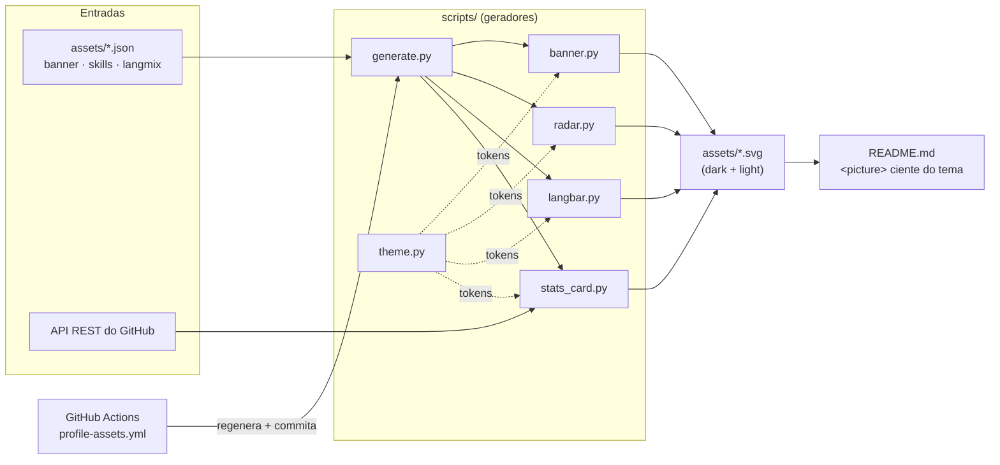

# Como este perfil funciona

[🇺🇸 English](HOW-IT-WORKS.md) · 🇧🇷 Português

Este repositório é o meu **perfil** do GitHub — o `README.md` é renderizado na página do meu
perfil. Os visuais não são imagens desenhadas à mão: são **SVGs gerados a partir de dados**
por pequenos scripts Python, mantidos atualizados por um workflow do GitHub Actions. Este
documento mostra como a máquina é construída, peça por peça, e como alterar cada parte (ou
forkar para o seu próprio perfil).

## Visão geral



**A ideia:** dados editáveis (`assets/*.json`) mais dados ao vivo do GitHub fluem por
geradores puros até virarem SVGs com tema, que o README exibe via `<picture>` para que cada
visitante veja a variante dark ou light. O CI reexecuta os geradores e commita o resultado,
então o perfil se mantém atual sem trabalho manual.

## Início rápido

```bash
git clone https://github.com/GiovaniRodrigo/GiovaniRodrigo.git
cd GiovaniRodrigo
python scripts/generate.py     # regenera todos os SVGs em assets/
python -m pytest -q            # roda a suíte de testes (41 testes)
```

Nenhum pacote Python de terceiros é necessário para gerar os assets — os scripts usam apenas
a biblioteca padrão. O `pytest` é a única dependência de desenvolvimento.

## A construção, passo a passo

### 1. Tokens de tema — `scripts/theme.py`

Todos os geradores compartilham uma paleta. `theme("dark")` / `theme("light")` retornam um
dicionário de tokens (`bg`, `panel`, `grid`, `text`, `muted`, `accent`, …). A base é o dark
neutro do GitHub `#0d1117`; o destaque é um ciano neon tech. O neon fica vivo no dark mas
some no branco, então o tema light troca por uma variante mais profunda e ainda vibrante.
Mude a aparência inteira a partir deste único arquivo.

### 2. Banner — `scripts/banner.py` + `assets/banner.json`

Renderiza a janela de terminal animada `profile.sh --live`. Edite o conteúdo em
`assets/banner.json`:

```json
{
  "prompt": "$ ./profile.sh --live",
  "lines": [
    { "key": "role", "value": "DevOps & Full-Stack Engineer" }
  ]
}
```

As linhas aparecem uma após a outra via SMIL `<animate>` (que funciona no GitHub quando o SVG
é servido como imagem), e um cursor em bloco pisca no final.

### 3. Radares — `scripts/radar.py` + `assets/skills.json`, `assets/langmix.json`

Um único renderizador desenha os dois radares. Cada arquivo de dados é uma lista de eixos:

```json
{ "title": "self-rated skills", "axes": [ { "label": "Backend", "value": 80 } ] }
```

`skills.json` é um radar de skills **autoavaliado** (edite os números à vontade).
`langmix.json` é o radar de **linguagens**, ponderado a partir de dados reais dos
repositórios. Os valores vão de `0..100`; são necessários pelo menos três eixos.

### 4. Barra de linguagens — `scripts/langbar.py` + `assets/langmix.json`

Uma barra horizontal empilhada com legenda, normalizando os mesmos pesos do `langmix.json`
em porcentagens. É commitada para que o perfil nunca mostre imagem quebrada, independente de
qualquer serviço externo.

### 5. Card de estatísticas — `scripts/stats_card.py`

O único gerador que acessa a rede. Ele mantém três responsabilidades separadas:

- `fetch(user, token)` — adaptador fino da API REST do GitHub (repos, stars, seguidores).
- `render(stats, theme)` — renderizador de SVG puro.
- `main()` — liga fetch → render → arquivo, lendo um token de `METRICS_TOKEN` ou
  `GITHUB_TOKEN` no ambiente.

O token é opcional para dados públicos; ele só aumenta os limites da API. Os totais de bytes
por linguagem são "limpos" de dependências vendorizadas (um virtualenv commitado num repo,
caso contrário, apareceria como "94% Python").

### 6. Orquestrador — `scripts/generate.py`

Roda todos os geradores em ordem e escreve os dez SVGs em `assets/`. Se a chamada de rede do
card de stats falhar, ele registra um aviso e ainda assim produz os assets offline.

## O seam `render` e os testes

Cada gerador expõe uma **função pura** `render(data, theme) -> str` que retorna o SVG sem
acesso a rede ou disco. Essa fronteira única é o seam de teste: a suíte (`tests/`) alimenta
fixtures fixas e verifica propriedades *observáveis externamente* — o SVG é XML bem-formado,
cada label/valor aparece, os dois temas diferem, e entrada malformada levanta `ValueError`.
Como o `render` não toca em nada externo, os testes são offline e determinísticos. O
adaptador `fetch` é mantido fino e de propósito fora dos testes unitários.

## Render ciente de tema no README

Cada asset é emitido em variante `dark` e `light`, e o README escolhe por visitante:

```html
<picture>
  <source media="(prefers-color-scheme: dark)"  srcset="assets/banner-dark.svg">
  <source media="(prefers-color-scheme: light)" srcset="assets/banner-light.svg">
  
</picture>
```

## Workflow de CI — `.github/workflows/profile-assets.yml`

Em um cron diário, no push para `main` (quando `assets/*.json` ou `scripts/**` mudam) e no
disparo manual, o workflow:

1. roda a suíte de testes,
2. regenera todos os SVGs,
3. commita as mudanças de volta se algo diferir.

Um job opcional do [`lowlighter/metrics`](https://github.com/lowlighter/metrics) roda apenas
quando existe um secret `METRICS_TOKEN`, publicando um `metrics.languages.svg` mais rico ao
lado do `languages-*.svg` commitado.

## Widgets hospedados (sem build)

Algumas peças são serviços externos referenciados direto do README:

- **Visualizações do perfil** — [antonkomarev/github-profile-views-counter](https://github.com/antonkomarev/github-profile-views-counter) (`komarev.com/ghpvc`).
- **Tagline digitada** — [readme-typing-svg](https://github.com/DenverCoder1/readme-typing-svg).
- **Ícones de stack** — [skillicons.dev](https://skillicons.dev).
- **Badges de social** — [shields.io](https://shields.io).

## Forke para o seu perfil

1. Crie um repositório com exatamente o seu username do GitHub (é o repo de "perfil").
2. Copie `scripts/`, `assets/`, `tests/` e `.github/workflows/`.
3. Edite `assets/*.json` com o seu conteúdo e defina o seu username em
   `scripts/generate.py` e `scripts/stats_card.py`.
4. Rode `python scripts/generate.py`, commite e adapte o `README.md`.
5. (Opcional) adicione um secret `METRICS_TOKEN` para limites de API maiores / métricas
   detalhadas.

## Como isto foi especificado

A mudança foi desenhada spec-first: a especificação completa está em
[`specs/profile-readme-revamp/spec.md`](../specs/profile-readme-revamp/spec.md) (problema,
histórias de usuário, decisões de implementação e de teste). As convenções de
agente/ferramentas do repo estão em [`CLAUDE.md`](../CLAUDE.md) e
[`docs/agents/`](agents/).
